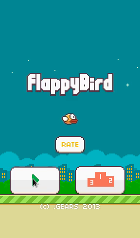

# About the Game

## Principle

The game itself is very simplistic. It is a 2D side scroller where the player attempts to keep a small bird in the air by tapping the touchscreen of the handheld device. Large pipes are constantly appearing on the screen and must be avoided. The player has only one life and no saves or checkpoints exist. There is no story nor greater goal in the game, apart from getting a better score by avoiding more pipes.

## History

Flappy Bird was created by Dong Nguyen, a small indie game developer based in Vietnam.

The game was available in Apple's App Store and Google Play until February 10 of 2014, when it was removed by the developer "due to its addictive nature".

Flappy Bird became incredibly popular in the early 2014 and caused a large amount of community responses. It was soon the most downloaded free game in the iOS App Store and was earning, according to the developer, \$50,000 daily from in-app advertisements.

It received many controversial reviews. Apart from being blamed for copying the green pipe design from Super Mario Bros games, as well as borrowing sound effects from them, Flappy Bird was also called "almost a complete ripoff" of a very similar game Piou Piou vs Cactus (2011).

Yet, despite being considered extremely addicting, irritating and difficult, Flappy Bird remained one of the most popular mobile game sensations of 2014.

## More Facts

Original Game Engine: [andengine](https://github.com/nicolasgramlich/AndEngine)

[An article about the Author of the original game](http://www.rollingstone.com/culture/news/the-flight-of-the-birdman-flappy-bird-creator-dong-nguyen-speaks-out-20140311).

## Browser Implementations:

Flash/ActionScript
http://www.classicgamesarcade.com/game/21741/flappy-bird-game.html

JavaScript
http://flappycreator.com/flappy.php
https://github.com/hyspace/flappy

## Other Tutorials

[A creation guideline with Scirra game creation kit](https://www.scirra.com/tutorials/857/flappy-birds-clone-in-10-minutes/page-1).

[Guideline for creation with libGDX and Java](http://www.kilobolt.com/day-1-flappy-bird---an-in-depth-analysis.html).

[Flappy Gopher](https://github.com/campoy/flappy-gopher) is a clone in Go with bindings for SDL2.

[OpenFlappyBird](https://github.com/deano2390/OpenFlappyBird) using the AndEngine Java

[Flappy Rust](https://github.com/deckarep/flappy-rust) Rust and SDL2.

## Similar Games

<http://www.helicoptergame.net/> (Flash Game, ca. 2004)
