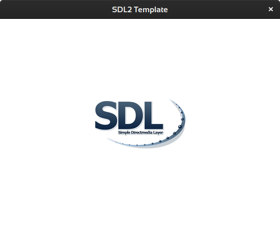
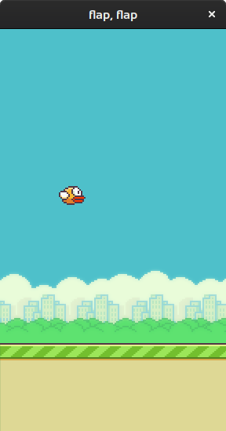
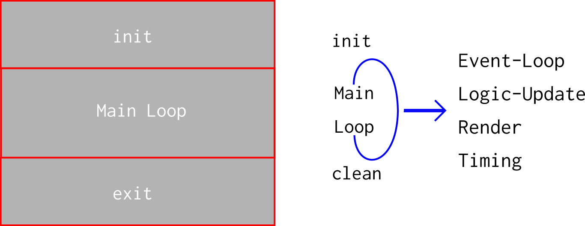

# Flappy Bird - C/SDL2-Implementation - Part 0

<< [Tool-Chain](Toolchain.md) | [TOC](TOC.md) | [Part 1](FlappyBird_1.md) >><br>

Outline:<br>
Render and animate background, ground, bird.

I do not know how deep one wants to go in understanding what is happening in the code. If you you have questions check [my SDL2-C section](https://acry.github.io/c.html) first.

- [build 0](#build-0)
- [0a - render game icon & background](#0a---render-game-icon---background)
  - [Game Icon](#game-icon)
  - [Render Background & Screen Size](#render-background---screen-size)
- [0b - render ground and bird](#0b---render-ground-and-bird)
  - [Add the ground](#add-the-ground)
  - [Show bird](#show-bird)
- [0c - animate bird and ground](#0c---animate-bird-and-ground)
  - [Ground](#ground)
- [Bird](#bird)
- [0d - Render random bird color and day/night background](#0d---render-random-bird-color-and-day-night-background)
  - [Set random background](#set-random-background)
  - [Setting a random bird color](#setting-a-random-bird-color)
- [Retrospective](#retrospective)
- [Outlook](#outlook)

## build 0

Type `make 0` change into `./Builds/Linux` and run `0` and you should see following screen.



If everything runs like expected you can move on, else try to fix it yourself. It is crucial to have everything until now under control. Later, as things become more complex, it may be very hard to gain control back.

## 0a - render game icon & background

### Game Icon

Original Link:
http://www.haotu.net/icon/163872/flappybird

[Archived Link](https://web.archive.org/web/20171211142820/http://www.haotu.net/icon/163872/flappybird)

Setting the game icon in the helper file.
For that there is helper_0.c

```c
icon=IMG_Load("../../assets/gfx/icon.png");
```

### Render Background & Screen Size

Declare the source rectangle for background, it is at 0,0,288,512

Set Screen Size:

```c
// CPP (Preprocessor)
// Define Window Size
#define WW 288
#define WH 512
```

Declare the background rect:

```c
// global
SDL_Rect bg_src;

// in function assets_in define the source rect
bg_src.x=0;
bg_src.y=0;
bg_src.w=288;
bg_src.h=512;
```

Load the sprite atlas `./assets/gfx/atlas.png` as texture:

```c
// rename logo to atlas, to declare the texture
SDL_Texture    *atlas		= NULL;

// in function assets_in load the image as surface and create a hardware texture
temp_surface = IMG_Load("../../assets/gfx/atlas.png");
atlas = SDL_CreateTextureFromSurface(Renderer, temp_surface);

// in function assets_out, which will be used for clean up destroy the texture before exiting
SDL_DestroyTexture(atlas);
```

Render the background

```c
// in the main loop
#pragma region RENDERING
SDL_RenderCopy(Renderer, Texture, &bg_src, NULL);
#pragma endregion RENDERING
```

View the result:
`make 0a`
`cd Builds/Linux;./0a`

## 0b - render ground and bird

### Add the ground

create source (src) & destination (dest) rectangle for the ground.

```c
// src rect
SDL_Rect grd_src;
grd_src.x=584;
grd_src.y=0;
grd_src.w=288; //max 336
grd_src.h=112;

// dst rect
SDL_Rect grd_dst;
grd_dst.x=0;
grd_dst.y=400;
grd_dst.w=336;
grd_dst.h=112;

// main loop after bg
SDL_RenderCopy(Renderer, atlas, &grd_src, &grd_dst);
```

### Show bird

x, y: 6, 982
w, h: 34, 24

```c

// declare src and dst rect
SDL_Rect bird_src;
SDL_Rect bird_dst;

//define both rects
bird_src.x=6;
bird_src.y=982;
bird_src.w=34; //max 336
bird_src.h=24;

bird_dst.x=75;
bird_dst.y=200;
bird_dst.w=34;
bird_dst.h=24;

//render both
SDL_RenderCopy(Renderer, atlas, &bird_src, &bird_dst);
```

`make 0b`

Screenshot of build 0b:<br>


## 0c - animate bird and ground

### Ground

Make simple logic to scroll ground and add it in the mainloop before rendering.

```c
grd_src.x+=1; //max 336
if (grd_src.x>=48+584)
	grd_src.x=584;
```

## Bird

Loop through 3 sprite frames

x, y: 6, 982
x, y: 62, 982
x, y: 118, 982

```c
if (bird_src.x == 6)
	bird_src.x=62;
else if (bird_src.x == 62)
	bird_src.x=118;
else if (bird_src.x == 118)
	bird_src.x=6;
```

Let the bird move up and down constraint, with the dest rect and a toggle var:

```c
// declare and init the vertical direction
int bird_move=1;

	if (bird_move){
		bird_dst.y++;
		if (bird_dst.y>=250)
			bird_move=0;
	} else{
		bird_dst.y--;
			if (bird_dst.y<=200)
			bird_move=1;
	}
```

The bird flaps very fast - one can adjust the delay somewhere in the mainloop, I do the timing later.

```c
SDL_Delay(25);
```

Now there is already some movement in our game.
`make 0c` and enjoy.

## 0d - Render random bird color and day/night background

Note:<br>
I had to adjust the atlas, cause it was a mess. Maybe it was done with some kind of a GUI-Tool.
Since the atlas changed, the coordinates for the animation of the bird changed, too.

Using another atlas in function `assets_in`:

```c
temp_surface = IMG_Load("../../assets/gfx/atlas3.png");
```

### Set random background

For the bg the x-value in the atlas is shifted.

```c
// add time
#include <time.h>
// feed the seed before assets are gonna be initialized
srand(time(NULL));
// use rand with 2 possible values in assets in, since we got 2 backgrounds
rand()%2;
```

```c
int bg=rand()%2;
SDL_Log("bg rand: %d",bg);
if (bg){
	bg_src.x=0;
	bg_src.y=0;
	bg_src.w=288;
	bg_src.h=512;
}else{
	bg_src.x=292;
	bg_src.y=0;
	bg_src.w=288;
	bg_src.h=512;
}
```

### Setting a random bird color

Same procedure, one needs to adjust the sprite atlas, no need to change the update function, just 3 possible outcomes and the y-value is shifted.

```c
int bird=rand()%3;
if (bird==0)
	bird_src.y=757;
else if (bird == 1)
	bird_src.y=783;
else if (bird == 2)
```

`make 0d` has the changes applied and the game pops up with a random bg and bird.

## Retrospective

The code base is still tiny, not a lot complexity and lines of code.<br>
The call-flow so far:



## Outlook

The next part will integrate games-states and reveal visuals of the idle state.

<< [Tool-Chain](Toolchain.md) | [TOC](TOC.md) | [Part 1](FlappyBird_1.md) >><br>
