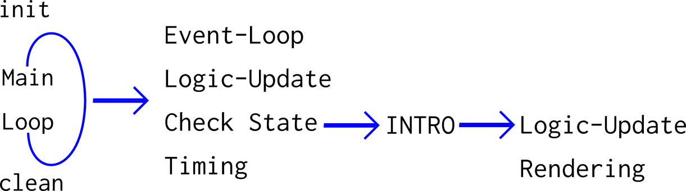
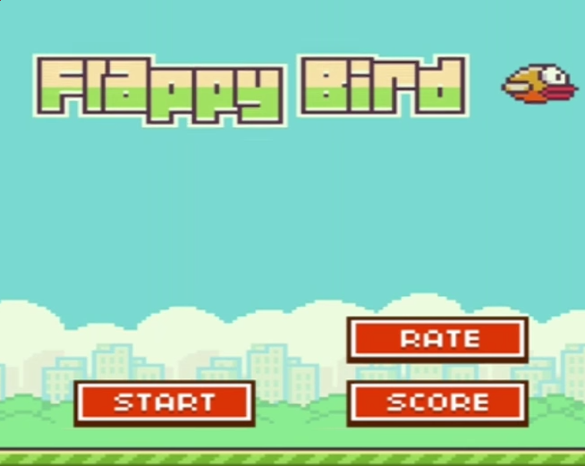
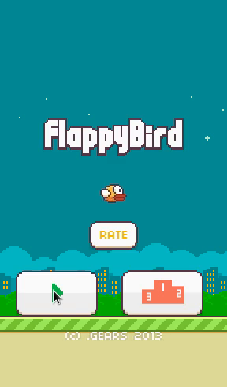

# Flappy Bird - C/SDL2-Implementation - Part 1

<< [Part 0](FlappyBird_0.md) | [TOC](TOC.md) | [Part 2](FlappyBird_2.md) >><br>

- [Introducing Game-States](#introducing-game-states)
- [1.c - State Vars & State Functions](#1c---state-vars---state-functions)
- [1a.c - Adding Idle Visuals](#1ac---adding-idle-visuals)
- [1b - First Input event - Switching Game States](#1b---first-input-event---switching-game-states)
- [Retrospective](#retrospective)
- [Outlook](#outlook)

## Introducing Game-States

By observing the original game one can see the most important runtime-states:

Idling is the first state. On pressing the Play-Button the game switches into the intro state. Then Playing or Paused and finally Game Over ... and repeat. The pause button toggles game and pause state.

In short:
Idle, intro, playing, game over, paused

In Code I will call those high level states:

`GS_PLAYING`, `GS_PAUSED`, `GS_IDLE`, `GS_OVER`, `GS_INTRO`

For the sake of completeness I mention the preparation and cleanup states, too:
Loading, Init & Exit<br>
The init-state sets up the game after loading, exit-state cleans up.

If you need an introduction into high-level game-states, check:<br>
<https://github.com/Acry/simple-state-pattern>

I call those states high level states to differentiate them from states what I call low level states or entity states, which are describing where each game entity, like the player, is positioned in the coordinate space or if it collides and so on.

## 1.c - State Vars & State Functions

Adding the global game states.

`game_state` hold the current high level state.

```c
int  game_state;
enum game_state { GS_PLAYING, GS_PAUSED, GS_IDLE, GS_OVER, GS_INTRO};
```

Telling (initializing) which state to start `game_state = GS_IDLE;` in main.<br>

Adding Function Prototypes for the state check:

```c
void game_state_check(void);
```

The Implementation of the state selection:

```c
void game_state_check(void)
{
	switch(game_state)
	{
		case GS_PLAYING:
			playing_update();
			break;

		case GS_PAUSED:
			paused_update();
			break;

		case GS_IDLE:
			idle_update();
			break;

		case GS_INTRO:
			intro_update();
			break;

		case GS_OVER:
			game_over_update();
			break;

		default:
			break;
	}
}
```

The Game-Loop now checks for events, clears the screen, checks which state we are in and call update and rendering for the particular state; after that the screen will be exposed and the timing will be done.

```c
	SDL_RenderClear(Renderer);
	gameState_check();
	SDL_RenderPresent(Renderer);
	SDL_Delay(25);
```

I gave every state a function that sets the state. One which does the logic (update) and one for rendering (draw).

```c
void playing_set(void);
void playing_update(void);
void playing_draw(void);
```

The code flow changed drastically, I skipped the process of adding Prototypes and Function-Definitions for each state. It can be checked in the code `1.c`.

Here is the current flow:


The code the animates the bird, background and ground, went into the `idle_update` function.

## 1a.c - Adding Idle Visuals

Now the Title, Rating button, Play button, Leaderboard button and Copyright notice will be added; what is redundant work, setting src & dst rectangles, adding more render calls.

Idle state or Menu, the picture looks somewhat different


Leaderboard and Rate Button won't be connected since this game is for educational-purposes only and not to be in the stores.

The idle-state will be filled with life, so after doing this, there will be a game-set- and an idle-set-function to get things up and running.

The bird will be horizontal centered now.

`1a` will expose all visuals states implemented.



## 1b - First Input event - Switching Game States

To switch states from idling to intro if the play button is activated.

Introducing the mouse rect.
Check for click and intersection with play rect.

Switching States interactively first time.

`1b` is event responsive.

Time to move out the event loop.
One could just handle over the events, I decided to handle them separately in the update loop - matter of taste imo. The events are now checked in the `idle_update`

```c
SDL_Event event;
int running = 1;
// goes global to be available to all update functions
```

```c
// In idle_update
SDL_GetMouseState(&mouse.x, &mouse.y);
// ...
if(event.type == SDL_MOUSEBUTTONDOWN){
	SDL_Log("Button Pressed");
	if(event.button.button == SDL_BUTTON_LEFT){
		SDL_Log("Left Button");
		if (SDL_PointInRect(&mouse, &play_dst)){
			SDL_Log("Hit");
			break;
			IntroSet();
			gameState = GS_INTRO;
		}
	}
}
```

Build and start `1b`, please start it from the shell to catch console output.
If the mouse hovers over the Play-Button and the left mouse button is pressed, SDL_Log will serve following output:

INFO: Button Pressed
INFO: Left Button
INFO: Hit

```c
gameState = GS_INTRO;
```

Would change the states, but it needs to be implemented before the: `break;` can be removed.

`1b`

## Retrospective

The state scaffolding added quite some complexity to gain flexibility. The game states will help with [separation of concerns (SoC)](https://en.wikipedia.org/wiki/Separation_of_concerns).

## Outlook

The next part will be more fun. I will finish the idle-state and start the playing-state; going into a bit of game-physics.

<< [Part 0](FlappyBird_0.md) | [TOC](TOC.md) | [Part 2](FlappyBird_2.md) >><br>
