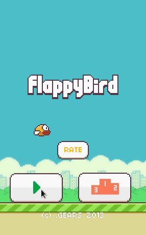

# Flappy Bird - C/SDL2-Implementation - Part 2

<< [Part 1](FlappyBird_1.md) | [TOC](TOC.md) | [Part 3](FlappyBird_3.md) >><br>

The intro & pause states, plus fun with game physics

- [2.c - The Intro State:](#2c---the-intro-state-)
- [2a.c - prepare playing State](#2ac---prepare-playing-state)
- [2b.c - Make it fly! - A little bit of physics](#2bc---make-it-fly----a-little-bit-of-physics)
- [2c.c - Refactoring Flapping](#2cc---refactoring-flapping)
- [2.d - Angle/Bearing/Rotation](#2d---angle-bearing-rotation)
- [2e.c - Implementing pause and connecting states](#2ec---implementing-pause-and-connecting-states)
- [Retrospective](#retrospective)
- [Outlook](#outlook)

## 2.c - The Intro State:


Switch the starting state to:

```c
gameState = GS_INTRO;
```

- Init rects, adjust update and render functions.
- Bird's x gonna move left a bit.
- We render the mini manual and get ready sign.

So after populating state's set, update and render functions, the ground and bird animation will be refactored so they can be used in different states.

```c
update_ground();
update_bird();
```


`./2`

## 2a.c - prepare playing State

We have already all visuals for the play state, except the pause button.

Copy and paste rendering from intro to playing and adjust shown elements.
Set `gameState = GS_PLAYING;` and in update pressing the LMB will just cause an `SDL_Log("Flap");`, which one can see if executed from the shell. The `break`'s in the previous two state updates is removed now.


`./2a`

## 2b.c - Make it fly! - A little bit of physics

`2b.c` will care of the flapping.

This part was actually really funny and I recommend to experiment with the formula. I have so many different builds on this with all kind of simple kinetic formulas. It is a complete different game all the time.

I ended up copying a formula from Stackoverflow.

```c
Update()
{
     if (PlayerTappedScreen){
            vertSpeed = jumpSpeed;
     }
     Position.Y += vertSpeed * deltaTime;
     vertSpeed -= fallingConstant * deltaTime;
}
```

> I was giving the bird a fixed impulse vertSpeed += speedIncrement and upon playing he immediately complained of the behavior. When I started to assign vertSpeed to a fixed speedIncrement (or jumpSpeed if you want), he then instantly recognizes the actual FlappyBird "feel".

We need a gravity which pulls the bird down.

```c
#define GRV	800
double gy=GRV;
```

And a bird's velocity, a force to push against the gravity.

```c
double vy=12;
double vx=200;
```

The formula reveals delta time needs to be tracked. That's the time difference between updates, or how long rendering takes. For this tiny game it's no issue, but I will revisited that timing in another post.

`SDL_Log("Flap");` will be substituted with `vy=-240;` and we need bound checking, so the bird wont leave the screen or fall through the ground.

```c
	//check upper bound
	if (bird_dst.y < -20)
	{
		vy = 100;
		bird_dst.y = -10;
	}
	//check lower bound
	if (bird_dst.y > 380)
	{
		vy = 0;
		bird_dst.y = 380;
	}
```


`./2b`

## 2c.c - Refactoring Flapping

Adjusting the flap speed and the timing when the bird actually flaps.

In the helper I set `SDL_RENDERER_PRESENTVSYNC` while setting the renderer.<br>
`Renderer = SDL_CreateRenderer(Window, -1, SDL_RENDERER_ACCELERATED | SDL_RENDERER_PRESENTVSYNC);`
SDL will synchronize to 60 Hz, what means that we have 1,000 ms/60 ms per frame, that are ~ 16.7 ms per frame. Probably my loop load takes like 2 ms or so.

The atlas has 3 frames for flapping. 1000 / 3 = 333.3333. I cut that through the half, setting `flap_delay` to 167, so it takes roughly 500 ms to rotate through all 3 frames.

```c
char flap_state = 0;
int flap_counter = 0;
int flap_delay = 17;

void bird_flap(void)
{
	// set bird anim state var
	flap_counter += flap_delay;
	if (flap_counter > 167)
	{
		flap_state = 1;
		flap_counter = 0;
	}

	//select bird frame
	if (flap_state)
	{
		if (bird_src.x == 355)
			bird_src.x = 390;
		else if (bird_src.x == 390)
			bird_src.x = 425;
		else if (bird_src.x == 425)
			bird_src.x = 355;
		flap_state = 0;
	}
}
```

I also refactored the vertical movement of the bird while in idle and intro state, the code is not new:

```c
char bird_flip_direction = 0;
void bird_slide(void)
{
		if (bird_flip_direction)
		{
			bird_dst.y++;
			if (bird_dst.y >= 250)
				bird_flip_direction = 0;
		}
		else
		{
			bird_dst.y--;
			if (bird_dst.y <= 200)
				bird_flip_direction = 1;
		}
}
```

It is called in `idle_update` and `intro_update`.


`2c`

## 2.d - Angle/Bearing/Rotation

In `update_bird`

```c
double bird_angle;
//set Angle
if (vy>100){
	bird_angle+=2;
	if (bird_angle>89)
		bird_angle=90;
}
else if (vy<=-100)
	bird_angle=340;
else
	bird_angle=0;
```

In `playing_draw`:

```c
SDL_RenderCopy(Renderer, atlas, &bird_src, &bird_dst);
// vs
SDL_RenderCopyEx(Renderer, atlas, &bird_src, &bird_dst, bird_angle, NULL, 0);
```


`./2d`

## 2e.c - Implementing pause and connecting states

The game will start in idle state. `game_state = GS_IDLE;` in main/init. If you press play or space the intro state will start. If you press space or click it will start playing.

Since we have no game over conditions yet, I will use the keys `g` for game over and `r` for replay/restart.

```c
case SDLK_g:
case SDLK_r:
idle_set();
intro_set();
game_state = GS_IDLE;
```

Set it in playing and paused update. Btw, how about putting different speeds or gravities on keys?


In my apk for Android there is no pause implemented, on iOS there was. The Pause-Button was top left. In my implementation it will be bottom left.

```c
SDL_GetMouseState(&mouse.x, &mouse.y);
if (SDL_PointInRect(&mouse, &pause_dst))
{
	game_state = GS_PAUSED;
}
```

Cause: Pause sign click/press or p
Effect: Game will be rendered, but not updated.



`./2e`

## Retrospective

That was quite some work. Actually there is a playing state now. I hope you played with the formula. we are at ~ 650 lines of code and the binary is at ~55 kb. I hope you enjoyed this part like I did back in time.

- I did a bit of refactoring.
- The game has a pause state now.
- 4 states are working and connected.

I really hope the code is not to messy right now =)

## Outlook

In the next part the obstacles (tubes) will be rendered and checked for collision, which means we have a game over trigger. The game over state is waiting to be done.

<< [Part 1](FlappyBird_1.md) | [TOC](TOC.md) | [Part 3](FlappyBird_3.md) >><br>
