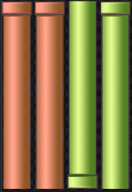
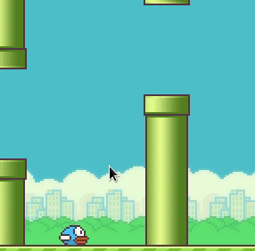
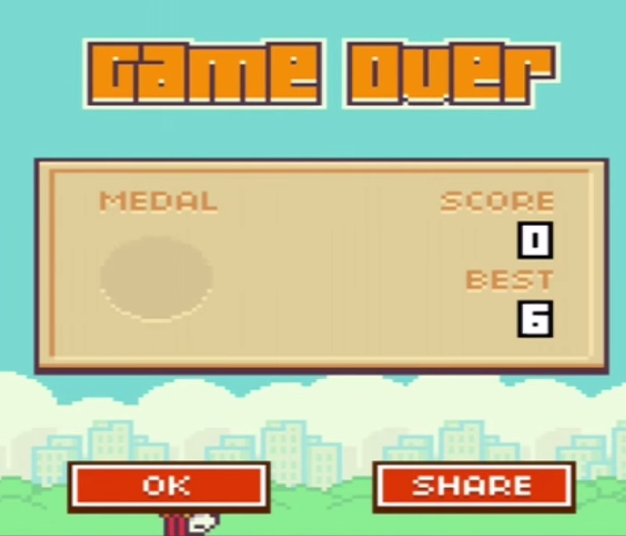
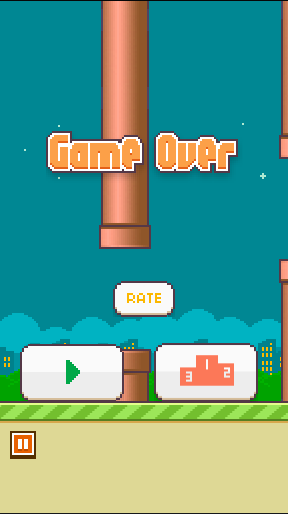

# Flappy Bird - C/SDL2-Implementation - Part 3

<< [Part 2](FlappyBird_2.md) | [TOC](TOC.md) | [Part 4](FlappyBird_4.md) >><br>

Pipes, Collision & Game Over

## 3.c - Obstacles

Observations:

- They are scrolling from left to right.
- There is a max. of 6 pipes at the same time.
- The distance between each set of pipes will be constant.
- The height of the opening varies, but the size of the opening does not.
- Move the column vertically to a random Y-Position when we reset its X-Position.

Those are the pipes from the sprite atlas, afaik those red pipes weren't used.



Since I started with day/night selection of the background, I will implement the night pipes also.

We just need one of each color and just flip it while drawing.

One also needs some properties from the observations:
I started with some rules of thumb while implementing. So the numbers of the properties came by testing the code.

Actually after playing around I would have gotten away with 4 pipes, but in case you want to experiment with those, there you go.

First I will set the game state back to playing `game_state = GS_PLAYING;`,
since the pipes are shown there. Then the preprocessor variables will be defined.
After that the globals.
In this section I will set the source and destination rectangle for the pipes.

### init

```c
#define PIPES 6
#define PIPE_START 600
#define PIPE_OPEN 100

#define PIPE_MIN_Y 210 // constrains the minimum top of a pipe
#define PIPE_MAX_Y 370 // constrains the maximum top of a pipe

#define PIPE_X_OFFSET 180 // offset between pipes
#define PIPE_STEP 2

// globals
SDL_Rect pipe_src;             // need one source rectangle for the pipes
SDL_Rect pipe_dst[PIPES];      // but as many dest-rests as max. shown

// playing_set
// select day or night pipe by background
if (bg_src.x==0){
	pipe_src.w=52;
	pipe_src.h=320;
	pipe_src.x=168;
	pipe_src.y=646;
} else {
	pipe_src.w=52;
	pipe_src.h=320;
	pipe_src.x=56;
	pipe_src.y=646;
}

// init pipe dest rects
int i;
for (i = 0; i < PIPES; i++)
{
	pipe_dst[i].w = pipe_src.w;
	pipe_dst[i].h = pipe_src.h;
}
```

playing set

```c
pipe_dst[0].x = PIPE_START;
pipe_dst[0].y = rand() % (PIPE_MAX_Y + 1 - PIPE_MIN_Y) + PIPE_MIN_Y;
pipe_dst[1].x = PIPE_START;
pipe_dst[1].y = pipe_dst[0].y - (pipe_src.h + PIPE_OPEN);
pipe_hit_dst[0].x = pipe_dst[0].x + pipe_src.w / 2;
pipe_hit_dst[0].y = pipe_dst[0].y - PIPE_OPEN;

pipe_dst[2].x = PIPE_START + PIPE_X_OFFSET;
pipe_dst[2].y = rand() % (PIPE_MAX_Y + 1 - PIPE_MIN_Y) + PIPE_MIN_Y;
pipe_dst[3].x = PIPE_START + PIPE_X_OFFSET;
pipe_dst[3].y = pipe_dst[2].y - (pipe_src.h + PIPE_OPEN);
pipe_hit_dst[1].x = pipe_dst[2].x + pipe_src.w / 2;
pipe_hit_dst[1].y = pipe_dst[2].y - PIPE_OPEN;

pipe_dst[4].x = PIPE_START + PIPE_X_OFFSET * 2;
pipe_dst[4].y = rand() % (PIPE_MAX_Y + 1 - PIPE_MIN_Y) + PIPE_MIN_Y;
pipe_dst[5].x = PIPE_START + PIPE_X_OFFSET * 2;
pipe_dst[5].y = pipe_dst[4].y - (pipe_src.h + PIPE_OPEN);
pipe_hit_dst[2].x = pipe_dst[4].x + pipe_src.w / 2;
pipe_hit_dst[2].y = pipe_dst[4].y - PIPE_OPEN;
//END 	SET pipe
```

Finally one needs to call playing_set(); in the region init,
else all rectangles will be uninitialized und therefore won't be rendered.

### update

```c
//BEGIN UPDATE pipes
for (i = 0; i < PIPES; i += 2)
{
	pipe_dst[i].x -= 1 + PIPE_STEP;
	pipe_dst[i + 1].x -= 1 + PIPE_STEP;
	if (pipe_dst[i].x + pipe_dst[i].w < 0)
	{
		if (i == 0)
		{
			pipe_dst[0].x = pipe_dst[4].x + PIPE_X_OFFSET;
			pipe_dst[0].y = rand() % (PIPE_MAX_Y + 1 - PIPE_MIN_Y) + PIPE_MIN_Y;
			pipe_dst[1].x = pipe_dst[i].x;
			pipe_dst[1].y = pipe_dst[i].y - (pipe_src.h + PIPE_OPEN);
		}
		if (i == 2)
		{
			pipe_dst[2].x = pipe_dst[0].x + PIPE_X_OFFSET;
			pipe_dst[2].y = rand() % (PIPE_MAX_Y + 1 - PIPE_MIN_Y) + PIPE_MIN_Y;
			pipe_dst[3].x = pipe_dst[i].x;
			pipe_dst[3].y = pipe_dst[i].y - (pipe_src.h + PIPE_OPEN);
		}
		if (i == 4)
		{
			pipe_dst[4].x = pipe_dst[2].x + PIPE_X_OFFSET;
			pipe_dst[4].y = rand() % (PIPE_MAX_Y + 1 - PIPE_MIN_Y) + PIPE_MIN_Y;
			pipe_dst[5].x = pipe_dst[i].x;
			pipe_dst[5].y = pipe_dst[i].y - (pipe_src.h + PIPE_OPEN);
		}
	}
}
//END 	UPDATE pipes
```

### rendering

In playing draw

```c
int i;
for (i = 0; i < PIPES; i++)
{
	if (i % 2)
		SDL_RenderCopyEx(Renderer, Texture, &pipe_src, &pipe_dst[i], 0, NULL, SDL_FLIP_VERTICAL);
	else
		SDL_RenderCopy(Renderer, Texture, &pipe_src, &pipe_dst[i]);
}
```



`./3`

## 3a.c - Collision check & Game Over State

I am using the dest rects of the pipes to check for collision.
`SDL_HasIntersection` does that for me, just throw 2 addresses in.

```c
	// Check collision of Pipes and bird
	for (i = 0; i < PIPES; i++)
	{
		if (SDL_HasIntersection(&bird_dst, &pipe_dst[i]))
		{
			game_over_set();
			game_state = GS_OVER;
		}
	}
```

Now that we have a lost/end of game trigger, we can switch over to the game over state.



global:

```c
SDL_Rect over_src; // Game Over Word
SDL_Rect over_dst; // Game Over Word
```

Call `game_over_set();` in the init region.

`game_over_set`

```C
void game_over_set(void)
{
	// Game over literals
	over_src.w = 197;
	over_src.h = 52;
	over_src.x = 790;
	over_src.y = 118;

	over_dst.w = over_src.w;
	over_dst.h = over_src.h;
	over_dst.x = (ww / 2) - (over_dst.w / 2);
	over_dst.y = 130;
}
```

`game_over_update`

```C
	update_bird();
	game_over_Draw();
```

`game_over_draw`

```C
void game_over_Draw(void)
{
	playing_draw();
	SDL_RenderCopy(Renderer, atlas, &over_src, &over_dst);
	SDL_RenderCopy(Renderer, atlas, &play_src, &play_dst);
	SDL_RenderCopy(Renderer, atlas, &lb_src, &lb_dst);
	SDL_RenderCopy(Renderer, atlas, &rate_src, &rate_dst);
}
```



`./3a`

## Retrospective

That is it. We have a prototypal implementation of all states.
The bird is falling through pipes when it died between the pipes.

## Outlook

I will refactor set states to split it in init & set, it is not necessary to init most of the source rects which each set. I will initialize static source rects in `assets_in`. But that is a really tiny issue, more like optimization.

Then I will implement the score and the highest score.
The score will be rendered with pixel mapping to the atlas.

<< [Part 2](FlappyBird_2.md) | [TOC](TOC.md) | [Part 4](FlappyBird_4.md) >><br>
