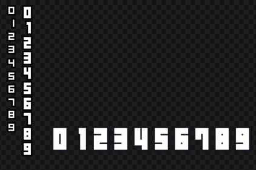
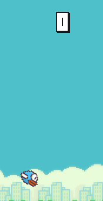
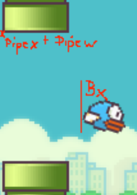
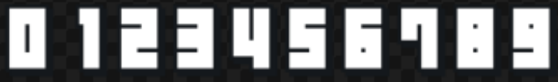
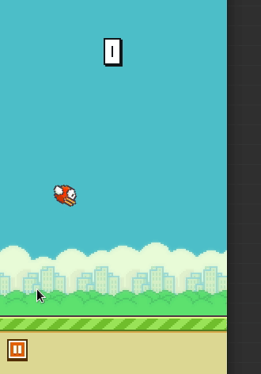

# Flappy Bird - C/SDL2-Implementation - Part 4

<< [Part 3](FlappyBird_3.md) | [TOC](TOC.md) | [Part 5](FlappyBird_5.md) >><br>

Scores and hiscores

## 4.c - Init and draw the score



There are 3 different sizes of digits.
The biggest digits are used to show the score during the play state.

Actually the score is already shown in the intro state, so it needs to be set there.

globals:

```c
// Score
SDL_Rect number_src[10];
SDL_Rect number_dst[3];
```

```c
int i;
// init numbers source rects
for (i = 0; i < 10; i++)
{
	number_src[i].x = 358 + (i * (24 + 4));
	number_src[i].y = 691;
	number_src[i].w = 24;
	number_src[i].h = 36;
}

// init digit 0
number_dst[0].w = 24;
number_dst[0].h = 36;
number_dst[0].y = 50;
number_dst[0].x = 128;
```

Test Rendering:

```c
SDL_RenderCopy(Renderer, Texture, &number_src[0]], &number_dst[0]);
```

... called in the intro and play state.



`./4`

## 4a.c - Track and update score

Count the score:

Every time the bird passes a pipe, one point will be added.
Need a score-tracking var: `Uint8 current_score;`

Now check if the player gained a point and add it to the current score.
`current_score += 1;`

Sounds simple, right? There are like always thousands of ways to do that.

I decided to implement it this way:

For every pipe I created a status var:
`SDL_bool pipe_passed_player[3];`

It will be set to false in the beginning and every time a pipe spawns.

The first time when a pipe passes the player the player will score and the state var will be set. So it wont be checked again until it spawns.



In update pipes:

```c
if (
	   (pipe_dst[i].x + pipe_dst[i].w) < (bird_dst.x )
	&& (pipe_passed_player[i / 2] == SDL_FALSE)
   )
{
	pipe_passed_player[i / 2] = SDL_TRUE;
	current_score += 1;
}
```

In this build I log the score to the shell:
`SDL_Log("Current Score: %d", current_score);`
See if that works:

`./4a`

## 4b.c - update the rendered digit(s)

Now the digit becomes a number:

Remove the logging and map the `current_score` to the bitmap digits.
After updating `current_score` I will call the new function `update_score`.



For a number of one digit it is like this.

`SDL_RenderCopy(Renderer, atlas, &number_src[current_score], &number_dst[0]);`

setting the source rect according to the score number. You can try that out.

I am gonna support a score up to 999. So I need 3 digits to display the score.

So how do we find out how many digits a number has?

Actually this topic bothered me most =) It has been done a million of times, but I wanted to find some ways to do it. Think I could write down ten ways of doing it here.

Two ways finding out how many digits a number has:

```c
// copy the score to a local var
int number = current_score;

do
{
	number_of_digits++;
	number /= 10;
} while(number != 0);

// or the same as while loop
while (number > 0)
{
	number /= 10;
	number_of_digits++;
}

// or
number_of_digits = (current_score == 0) ? 1 : (log10(current_score) + 1);
```

You can check it here: <https://ideone.com/P1h8Ne><br>

But at that time one still has no clue what the value of every digit is.
It's not that I I can use just simply call something like in JavaScript:

```js
Array.from(String(789), Number);
```

or in Python

```python
list(map(int, str(789)))
```

One wants something like this:

```c
digit[0]=7;
digit[1]=8;
digit[2]=9;
```

I ended up using something like this: <https://ideone.com/wy3gDI>

mod and /= 10 will slice the score into digits.

```c
void update_score(void)
{
	if (score_cp != score)
	{
		score_counter = 0;
		score_cp = score;
		score_cp2 = score_cp;

		/* Note that this will give you the digits in reverse order (i.e. least
		 * significant digit first). If you want the most significant digit first,
		 * you'll have to store the digits in an array, then read them out in reverse
		 * order.
		 */
		while (score_cp2 > 0)
		{
			int digit = score_cp2 % 10;
			digits[score_counter] = digit;
			score_cp2 /= 10;
			score_counter++;
		}
	}
}
```

... and render it like this depending on how many digits there are:

```c
SDL_RenderCopy(Renderer, Texture, &number_src[digit[i]], &number_dst[i]);
```

My solution now may surprise you, you can check it out here: <https://ideone.com/cfPLFY>

It looks like this:
In `render_score`

```c
SDL_RenderCopy(Renderer, atlas, &number_src[(current_score - (current_score % 10)) / 10], &number_dst[0]);
SDL_RenderCopy(Renderer, atlas, &number_src[current_score % 10], &number_dst[1]);
```

If you want to test it, `return` before collision check of pipes and bird.



`./4b`

## 4c.c - Tracking and saving highest score

In my apk was this file used to track the highest score:
`/data/data/com.dotgears.flappybird/shared_prefs/FlappyBird.xml`

First of all I am gonna test collision to the ground.

```C
if (SDL_HasIntersection(&bird_dst, &grd_dst)
{
	game_over_set();
	game_state = GS_OVER;
}
```

Since it will be only checked during game update, I will put it there.
Then set the starting `game_state` to `GS_INTRO;` for coding.

Now we are good to go.

new global:
`int highest_score;`

And two new functions, read and write highscore.

open file and read file:

```c
void read_highscore(void)
{
	SDL_RWops *file = NULL;
	file = SDL_RWFromFile("hiscore", "r");
	if (file)
	{
		SDL_RWread(file, &highest_score, sizeof(int), 1);
		SDL_RWclose(file);
		SDL_Log("read hiscore %d", highest_score);
	}
	else
	{
		highest_score = 0;
		write_highscore();
	}
}
```

write file

```c
void write_highscore(void)
{
	SDL_RWops *file = SDL_RWFromFile("hiscore", "w+");
	SDL_RWwrite(file, &highest_score, sizeof(int), 1);
	SDL_Log("wrote hiscore %d", highest_score);
	SDL_RWclose(file);
}
```

In `game_over_set` check for new hiscore.

```c
if (current_score > highest_score)
{
	highest_score = current_score;
	SDL_Log("new hiscore %d", highest_score);
	write_highscore();
}
```

Set back `game_state` to `GS_IDLE;`.

Currently there is no error-checking in read/write. That is bad, but works for me.

`./4c`

## Special

I am gonna strip the binary for the first time, to see what it will do:

ls -l 4b is at 61128 bytes / 60k

strip results in 22776 bytes / 21k

`man strip` discard symbols and other data from object files

`man sstrip` truncates ELF files to remove non-program content

Not that it matters on a giant desktop machine. On my machine electron, in case of vscode or java in case of webstrom/pycharm plus chromium are sucking more than 10 gigs of ram. But it is a good feeling that one could write a smaller executable for embedded devices.

If you are interested in this topic, go read <http://www.muppetlabs.com/~breadbox/software/tiny/teensy.html>

## Retrospective

The digit bitmap rendering took me quite a while. Imo that's not worth doing it anymore, but now I have it =) Today it is way easier to work with strings and fonts.

## Outlook

Need to render the hiscore, the medals and the new hiscore badge. Finally it is time to add the sound.

<< [Part 3](FlappyBird_3.md) | [TOC](TOC.md) | [Part 5](FlappyBird_5.md) >><br>
