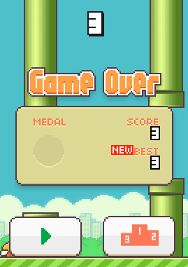

# Flappy Bird - C/SDL2-Implementation - Part 5

<< [Part 4](FlappyBird_4.md) | [TOC](TOC.md) | [Part 6](FlappyBird_6.md) >><br>

Back to ...


## Awards

Going to reward players now =)


Medals are awarded at the following points:

Bronze: 10 pts, Silver: 20 pts, Gold: 30 pts, Platinum: 40 pts

They will be shown on the summary board.

## 5.c - Summary board


```c
\\globals

SDL_Rect sum_src;
SDL_Rect sum_dst;

// summary rects in game over set
sum_src.w = 231;
sum_src.h = 123;
sum_src.x = 6;
sum_src.y = 518;

sum_dst.w = sum_src.w;
sum_dst.h = sum_src.h;
sum_dst.x = (width / 2) - (sum_dst.w / 2);
sum_dst.y=185;
```

I will swap the summary board vs. the rating button.

```c
\\ game over draw
SDL_RenderCopy(Renderer, Texture, &sum_src, &sum_dst);
```

That's it. I think the original board looks like this:


We are here now:


`./5`

## 5a.c - Medals

```c
// globals
// medals
SDL_Rect medal_src;
SDL_Rect medal_dst;

// game over set
// init medal source rect
// set src.x on on score
if (current_score > 9 && current_score < 19)
	medal_src.x = 309;
else if (current_score > 19 && current_score < 29)
	medal_src.x = 309 + 1 * 46;
else if (current_score > 29 && current_score < 39)
	medal_src.x = 309 + 2 * 46;
else if (current_score > 39)
	medal_src.x = 309 + 3 * 46;
else
	medal_src.x = 0;

medal_src.y = 852;
medal_src.w = 44;
medal_src.h = 44;

// init medal dest rect
medal_dst.x = 57;
medal_dst.y = 226;
medal_dst.w = 44;
medal_dst.h = 44;
```

I am abusing `medal_src.x` as state var here.

```c
if (medal_src.x)
	SDL_RenderCopy(Renderer, Texture, &medal_src, &medal_dst);
```

In line 351 you can adjust the starting score: `current_score = n;` to test the medals.

Alright, done.

`./5a`

## 5b.c - Render score, high score and new high score sign

This is another repetitive task. I solved the main problem in the last part.

Both, the hiscore and the current score on the board are using the same digits.
They just have different target rectangles.

```c
SDL_Rect score_to_board_dst[3];
SDL_Rect hiscore_to_board_dst[3];
```

The 2 functions will be added to render both and they need to be called in game over draw and we can get rid of the log messages.

The new hiscore sign get the globals:

```c
SDL_Rect new_hiscore_src;
SDL_Rect new_hiscore_dst;
```

Those will be set in game over set.

Again I will use the x value as state var and set it when there is a new hiscore.

```c
new_hiscore_dst.x = 0; // as state var

if (new_hiscore_dst.x)
	SDL_RenderCopy(Renderer, atlas, &new_hiscore_src, &new_hiscore_dst);
```



`./5b`

## 5c.c - Sounds

I will extend the helper

```c
#include <SDL2/SDL_mixer.h>
```

The init function calls:

```c
Mix_Init(MIX_INIT_OGG);
Mix_OpenAudio(44100, MIX_DEFAULT_FORMAT, 2, 2048);
```

And the exit function now calls:

```c
Mix_CloseAudio();
Mix_Quit();
```

In 5c.c I include the new helper:

```c
#include "helper_1.h"
```

set the default volume:

```c
#define MIX_VOLUME 90 //max 128
```

Set the globals:

```c
//BEGIN SOUNDS
Mix_Chunk *flap_chunk = NULL;
Mix_Chunk *hit_chunk = NULL; // collision
Mix_Chunk *wooosh_chunk = NULL;
Mix_Chunk *collide_chunk = NULL;
Mix_Chunk *point_chunk = NULL;
//END SOUNDS
```

pull the assets in and set the volume:

```c
flap_chunk = Mix_LoadWAV("sfx_wing.ogg");
Mix_VolumeChunk(flap_chunk, MIX_VOLUME - 40);

hit_chunk = Mix_LoadWAV("sfx_hit.ogg");
Mix_VolumeChunk(hit_chunk, MIX_VOLUME);

wooosh_chunk = Mix_LoadWAV("sfx_swooshing.ogg");
Mix_VolumeChunk(wooosh_chunk, MIX_VOLUME);

collide_chunk = Mix_LoadWAV("sfx_die.ogg");
Mix_VolumeChunk(collide_chunk, MIX_VOLUME);

point_chunk = Mix_LoadWAV("sfx_point.ogg");
Mix_VolumeChunk(point_chunk, MIX_VOLUME);
```

clean the assets up:

```c
Mix_FreeChunk(flap_chunk);
Mix_FreeChunk(hit_chunk);
Mix_FreeChunk(wooosh_chunk);
Mix_FreeChunk(collide_chunk);
Mix_FreeChunk(point_chunk);
```

Now we are good to use the sounds:

```c
Mix_PlayChannel(-1, collide_chunk, 0);
Mix_PlayChannel(-1, flap_chunk, 0);
Mix_PlayChannel(-1, hit_chunk, 0);
Mix_PlayChannel(-1, point_chunk, 0);
Mix_PlayChannel(-1, wooosh_chunk, 0);
```

You can check the source where I called the Play functions.

`./5c`

## Retrospective

The number of things that need to be done is shrinking =)

Now the scoreboard rendering is complete. There are medals, scores and a new highest score alert. The audio has has a lot impact on game play (User Experience / UX) for the most people and is very cheap to achive. Since the sound chips perform poor compared to modern GPU's, there is not much more one can do than just play and mix samples. That is why I gave up my work on sound synthesis.

You can check out this project: <http://www.drpetter.se/project_sfxr.html> if you want to play with sound. I ported that code to SDL2, think it is not pushed yet. He also provides a small introduction into audio: <http://www.drpetter.se/article_sound.html>. And while visiting his page take a look at the [projects](http://www.drpetter.se/projects.html). The whole point of this tutorial is helping empowering people to understand game development and encourage people to write cool projects or cool code. And maybe you and me will get in touch to work on an awesome project in the future.

Ofc creating a 2D side scroller can't be compared to the work at a triple A studio. But we will [get there](Next.md). This is just a pit stop to take theory to completion.

## Outlook

To round the game up I will do the screen transitions and animations next.

<< [Part 4](FlappyBird_4.md) | [TOC](TOC.md) | [Part 6](FlappyBird_6.md) >><br>
