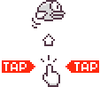

# Flappy Bird - C/SDL2-Implementation - Part 6

<< [Part 5](FlappyBird_5.md) | [TOC](TOC.md) | [Part 7](FlappyBird_7.md) >><br>

## Effects:

Visual effects are most often a lot of work but are loved in the entertainment and advertising area. There are tons of eye-candy in web development, movies, games, commercials.

See [my effects repo](https://github.com/Acry/Demo-Effects-Collection) and [my surfaces repo](https://github.com/Acry/SDL2-Surfaces) for some examples.

### Screen transitions

Transitions from one scene or action to another can be done in plenty ways.

[See my transitions repo](https://github.com/Acry/SDL-Transitions)

They can be done linear or not. See [my repo for non linear animations](https://github.com/Acry/Non-Linear-Animations)

#### White death flash `6.c`

I am gonna let the screen flash white when the bird dies.

When does the bird die?
Either when it hits the ground or when it collides with a pipe.


Function: `playing_update`
```c
// Check collision with ground
HasIntersection(&bird_dst, &grd_dst)
```

```c
if (SDL_HasIntersection(&bird_dst, &grd_dst))
{
    Mix_PlayChannel(-1, hit_chunk, 0);
    Mix_PlayChannel(-1, collide_chunk, 0);
    game_over_set();
    game_state = GS_OVER;
}
```

Function: `update_pipes`

```c
// Check collision with pipes
HasIntersection(&bird_dst, &pipe_dst[i])
```

```c
for (i = 0; i < PIPES; i++)
{
	if (SDL_HasIntersection(&bird_dst, &pipe_dst[i]))
	{
		Mix_PlayChannel(-1, hit_chunk, 0);
		Mix_PlayChannel(-1, collide_chunk, 0);
		game_over_set();
		game_state = GS_OVER;

	}
}
```

The code that is executed when the bird dies is the same in both cases.
So I will write a function that is called when the bird dies.

Let me refactor it.

The containing code is:

```c
Mix_PlayChannel(-1, hit_chunk, 0);
Mix_PlayChannel(-1, collide_chunk, 0);
game_over_set();
game_state = GS_OVER;
```
This will be the function body.


Gets no param, doesn't return anything. I will call it `bird_dies`.

This is the final function:

Prototype:
```c
void bird_dies(void);
```

Implementation:
```c
void bird_dies(void){
	Mix_PlayChannel(-1, hit_chunk, 0);
	Mix_PlayChannel(-1, collide_chunk, 0);
	game_over_set();
	game_state = GS_OVER;
}
```

It compiles, it runs - the behavior is the same.

One more thing:  
`bird_dies` is called in `playing_update` and  `update_pipes`.
For more consistence I put the collision checking for ground into `update_ground` and rename the function to `update_bird` to `bird_update`.

And in `playing_update` I change the order of function calls to:

```c
update_pipes();
update_ground();
bird_update();
bird_flap();
playing_draw();
```

Alright, now there is one place to emit a flash. And the flash will only be visible during `playing_draw`.

There will be a white rect on top of the render stack, that reduces its alpha over time.

transition_rect will be that white rect on top .
`SDL_Rect transition_rect;`

We need to initialize the rect.
I will do that in `assets_in`.

The state var to track if the `transition_rect` should be rendered:  
```c
char flash;
```

The code snippet to actually render the rect when `flash` is set:

```c
if (flash)
{
	SDL_SetRenderDrawColor(Renderer, 255, 255, 255, alpha);
	SDL_RenderFillRect(Renderer, &transition_rect);
}
```

The variable that holds the alpha value:
```c
Uint8 alpha;
```


in `playing_set` I set alpha to 0:

```c
alpha = 0;
```

When the bird dies stuff gets triggered:  

`bird_dies`

```c
alpha = 255;
flash = 1;
```

Now the playing screen renders a white overlay, as long as `flash` is set.
To reduce the `alpha` and unset `flash` once `alpha` is 0, I need some kind of logic and a place to insert it to alter the `alpha` value.

`game_over_update`
```c
if (flash){
	alpha -= 15;
	if (alpha == 0) flash = 0;
}
```

#### Fade get ready out `6a.c`

Now I want to fade this two assets out, when the game starts.




They are both from the sprite atlas.

The mini Instructions source and dest rects are called:  
`intro_src`, `intro_dst`

and for get ready it's:  
`ready_src`, `ready_dst`

In which game states are they currently rendered?  
`intro_draw`

```c
SDL_RenderCopy(Renderer, atlas, &intro_src, &intro_dst);
SDL_RenderCopy(Renderer, atlas, &ready_src, &ready_dst);
```

When the playing state starts, it should start fading.

That means both rects need to be rendered within `playing_draw.`  
That is easy to do. 

Now I need a state var to signal if it should be shown:  
`show_ready`  
and a var that holds the alpha value:  
`ready_alpha`  

in `playing_set` they are set with the wanted values:

```c
show_ready = 1;
ready_alpha = 255;
```

Logic goes to `playing_update`
```c
if (show_ready){
	ready_alpha -= 5;
	if (ready_alpha == 0) show_ready = 0;
}
```

The final piece of code in `playing_draw`:

```c
if (show_ready){

	SDL_SetTextureAlphaMod(atlas, ready_alpha);

	// get ready
	SDL_RenderCopy(Renderer, atlas, &ready_src, &ready_dst);

	// mini instructions
	SDL_RenderCopy(Renderer, atlas, &intro_src, &intro_dst);
	
	SDL_SetTextureAlphaMod(atlas, 255);
}
```

This time I use `SDL_SetTextureAlphaMod` to set alpha value of the `atlas` before I render it. And set it back to max after both assets are rendered.

That is it. Now 'get ready' and the mini instructions are fading out.

#### Fading game states `6b.c`

Another simple screen transition. Fade to black and the inverse fade from black. Fading in and fading out.

Which game states are going to use that fading?

- Game Over fades to black
- Intro fades from black and fades to black
- Idle fades from black and to black

The starting state is idle, set before the main loop starts with `game_state = GS_IDLE;`

Now I am going to fade that from black.

`fade_from_black` state var.

```c
// TRANSITION
char flash;
char show_ready;
char fade_from_black;
```

and `Uint8 fade_from_black_alpha;`

I reuse the `transition_rect`

Need to render the `transition_rect` with the current alpha if `fade_from_black` is set. Which I set in `idle_set`.

alpha value needs to altered in `idle_update`.

I use the same logic as before.

Now fade in. The trick here is to start fading when the player acts and switch game state when fade to black is done.

Where are player actions gotten? In `idle_update`.


After declaring the globals `fade_to_black` state var and `Uint8 fade_to_black_alpha;` I set them in `idle_set`:
```c
fade_to_black = 0;
fade_to_black_alpha = 0;
```

in `idle_update` I alter the logic:
```c
if (event.type == SDL_MOUSEBUTTONDOWN)
{
	if (event.button.button == SDL_BUTTON_LEFT)
	{
		if (SDL_PointInRect(&mouse, &play_dst))
		{	
			fade_to_black = 1;
		}
	}
}

if (fade_to_black){
	fade_to_black_alpha += 5;
	if (fade_to_black_alpha == 255){
		fade_to_black = 0;
		intro_set();
		game_state = GS_INTRO;
	}
}
```

Now the state switches after fading is done.
The fade in effect in the intro state is analogue to `GS_IDLE` `fade_from_black`.

And `fade_to_black` in `GS_OVER` is analogue to `GS_IDLE`.
## Retrospective

That's it. Flashing & fading done. As a left over piece we need to make input wait for transitions. I will do that when I add more input:

- keys
- joystick
- game controller

## Outlook

In part 7 I will do the left over animations.  

We got some more moving parts:
- scoreboard slides in
- game over text moves
- sparkles on the medals
- the score on the scoreboard counts up

<< [Part 5](FlappyBird_5.md) | [TOC](TOC.md) | [Part 7](FlappyBird_7.md) >><br>
