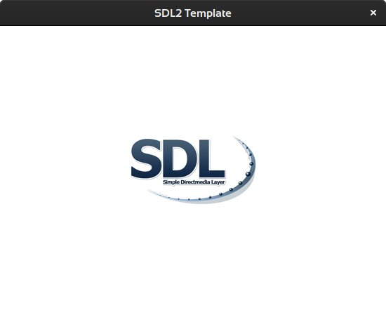

## Intro

## Install SDL on Arch-Linux

todo

## Prepare Makefile and Skeleton

### Skeleton

Not really necessary anymore.

~~I am using my KDevelop Light Template for Prototyping.~~

You can grab it here: <https://store.kde.org/p/1234090/>, here: <https://github.com/Acry/SDL2-C-KDev_App_Template_light> or directly in KDevelop.

### Makefile

```make
CFLAGS     = -no-pie -ggdb -Wall -Wextra -mtune=native `sdl2-config --cflags`
LDFLAGS    = `sdl2-config --libs` -lSDL2_image -lSDL2_mixer -lm

SRCDIR	    = Code/
BUILDDIR    = Builds/
WINDOWS     = Windows/
WINDOWS_DIR = $(BUILDDIR)$(WINDOWS)
ANDROID     = Android/
ANDROID_DIR = $(BUILDDIR)$(ANDROID)
LINUX       = Linux/
LINUX_DIR   = $(BUILDDIR)$(LINUX)

TARGETS     = 0

.PHONY: all
all: $(TARGETS)

0:   $(SRCDIR)helper.c $(SRCDIR)0.c
	@cc $(CFLAGS) -o $(LINUX_DIR)$@ $+ $(LDFLAGS)


.PHONY: clean
clean:
	@rm $(TARGETS) 2>/dev/null || true
```

Type `make 0` change into `./Builds/Linux` and run `0` and you should see following screen.



If everything runs like expected you can move on, else try to fix it yourself. It is crucial to have everything until now under control. Later, as things become more complex, it may be very hard to gain control back.
