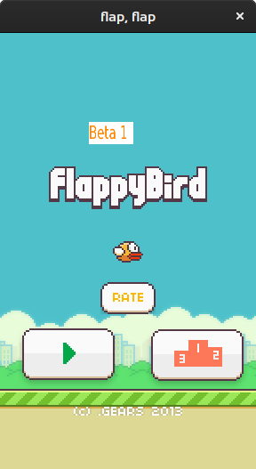

# Flappy Birds

## A rapid prototype implementation in SDL2-C

Going to implement [this game](DevDox/About_FB.md) across following platforms:  

Linux, Android, Windows, MacOS, iOS  

Checkout a short vid introducing the game from 2014: <https://www.youtube.com/watch?v=fQoJZuBwrkU>

Nearly feature complete, including sound and animations...

- I did this in 2017.

If you can't follow the tutorial, check: [Getting started with SDL2-C](https://acry.github.io/c.html)

[The Tutorial](./DevDox/TOC.md)

ToDo: finished static linux build.  
[Finished Android Build](https://www.dropbox.com/s/mpin68zb252a84z/SDLActivity-debug-1.apk?dl=0)  
[Finished Windows 64 Build](https://www.dropbox.com/s/w3v6831j8sjy1zs/flap.7z?dl=0)  

## Author and Contact

[Repo-Link](https://github.com/Acry/flappy) | [My Home Page](https://acry.github.io/) | [Game Page](https://acry.github.io/flappy.html)
